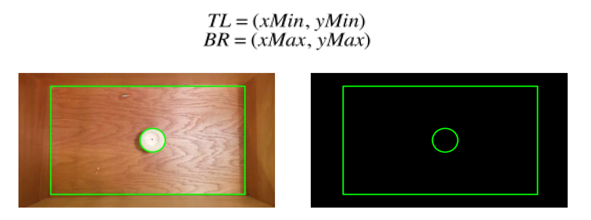
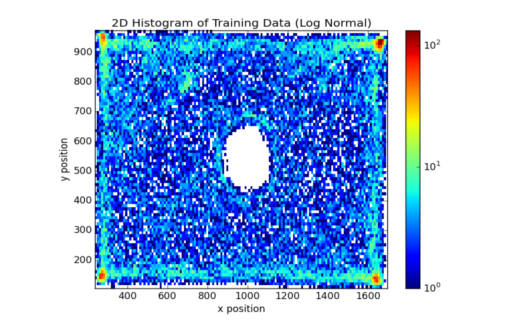
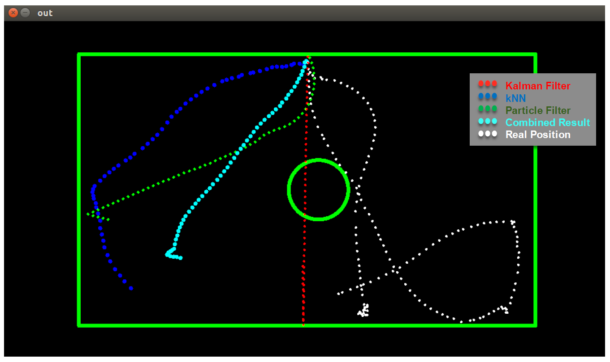
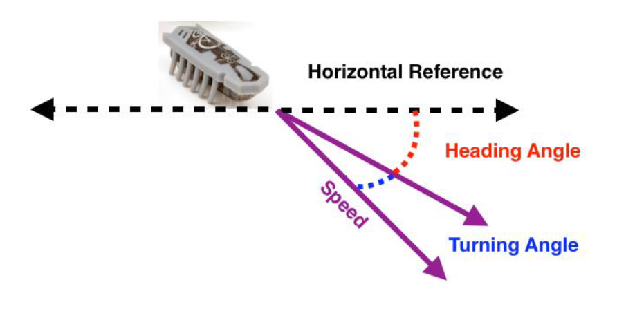
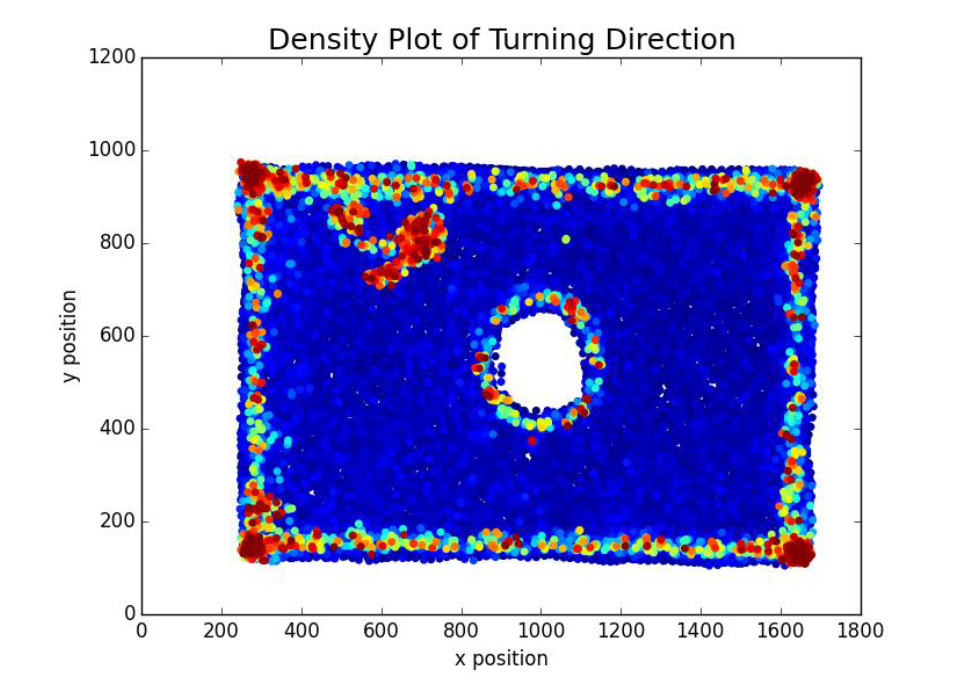
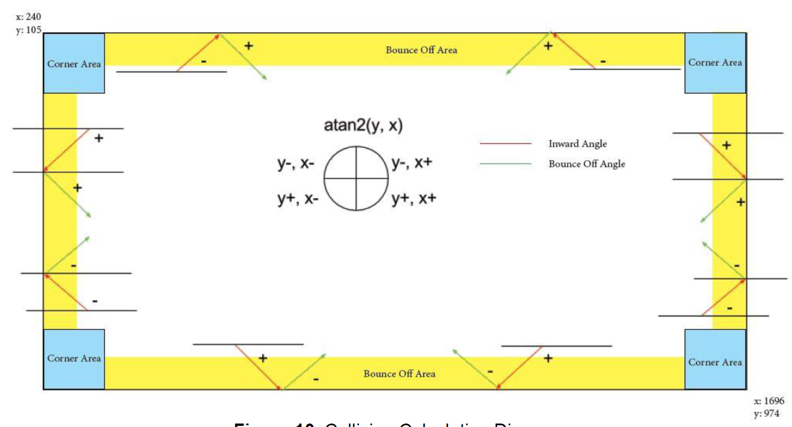
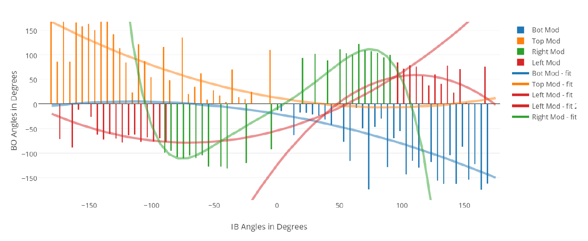

# Runaway-Robot

**Final Project 
CS 8803 AI for Robotics – Fall 2015 
Georgia Institute of Technology**

For this project, 60-second video clips of a robot moving in a wooden box was provided ten. Each video was recorded at 30 frames per second. The goal was to predict the position of the robot as accurately as possible for each of the following 60 frames (2 seconds) after the end of each video. The predictions were compared to the actual video data after the end of the video provided. In other words, the full videos were 62 seconds long, but only the first 60 seconds of each were provided, and predictions were compared to the last 2 seconds.  
About 20 minutes of “training” videos were provided, along with corresponding centroid data which were used to write the program.

## Report introduction
This report provides a thorough overview of the algorithm used to predict the position of the robot for 60 frames (2 seconds) after the end of each test case. The project was split into three main phases. 
First, the training data was used to infer a map of the world. 
Second, an ensemble learning (EL) algorithm was implemented to combine the predictions of Kalman Filter (KF) and k Nearest Neighbor (kNN). 
Third, the bouncing dynamics of the robot were modeled when it interacted with the world. This allowed to predict the outgoing angle given an incoming angle. 
The purpose of the report is to demonstrate that the implementation of the algorithm is reasonably sophisticated for a graduate level CS course. Moreover, compelling justification for the algorithm selection is provided. 
For complete report, see <a href="report.pdf">report.pdf</a>

## Screenshots:
 
Mapof the World (left) with Background Elimination (right)

 
Visualization of Training Data with 2-dimensional Histogram

 
Example EL Output # 1

 
Heading and Turning Angle Convention

 
High (red) and Low (blue) Turn Angles

 
Collision Calculation Diagram

 
Inward Angles vs. Bounce-off Angles (With Fitting Lines) 

## Execution Details
- Main File - finalproject.py 
- Training Data text file is reuired 
- training_data.txt is required for k-nearest neighbors algorithm. It must be in the same directory as finalproject.py file.

## Misc Folder
Misc folder contains different approaches that were designed during the development process, but were not incorporated in the Fnal Project 
- InwardBounceOffAngles.py file was used to create a database of Inward and Bounce Off angles, which was later used in Particle Filter approach  
- PF.py is our approach using particle filters. It performed well, but was computationally expensive and took more than 60 seconds to execute on Virtual Machine  
- LWR.py is our approach using Locally Weighted Regressions to account for non-linearity of Hexbug's trajectory

## Teammates
Johnson Kuan, Hai Dang, Ivan Fernandez
